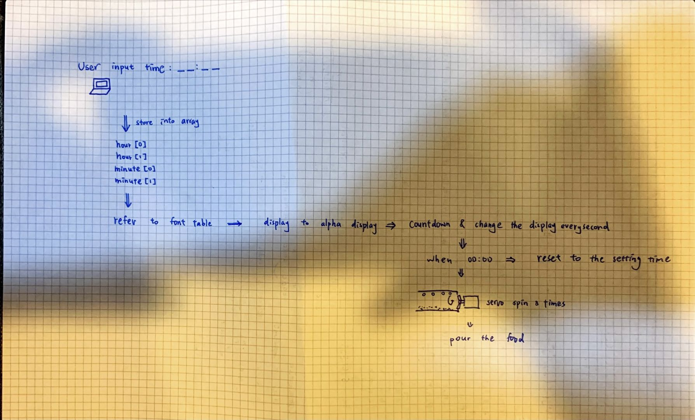
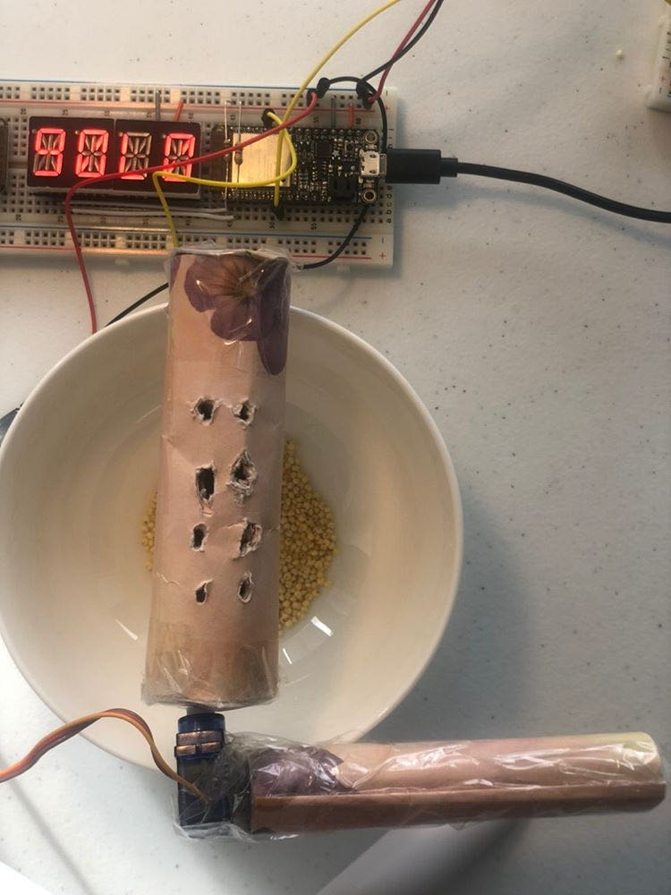
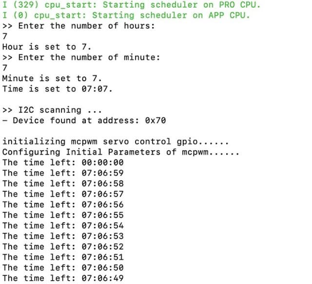

# Fish Feeder
Authors: Chen-Yu Chang, Hairuo Sun

Date: 2020-09-21
-----

## Summary
In this skill quest about fish feeder, we connected the i2c alphanumeric display and a servo to the ESP32 to create a automatic feeder. The alphanumeric board displays the hours and minutes that the user input as an interval, while the time will start the countdown. When the time counts to 00:00, it will go back to the countdown again. The servo will spin and drop some food to the fish tank during the process. User can set the time they want between each feeding.

## Self-Assessment

### Objective Criteria

| Objective Criterion | Rating | Max Value  |
|---------------------------------------------|:-----------:|:---------:|
| Objective One |  1  |  1     |
| Objective Two |  1  |  1     |
| Objective Three |  1  |  1     |
| Objective Four |  1  |  1     |
| Objective Five |  1  |  1     |
| Objective Six |  1  |  1     |
| Objective Seven |  1  |  1     |

### Qualitative Criteria

| Qualitative Criterion | Rating | Max Value  |
|---------------------------------------------|:-----------:|:---------:|
| Quality of solution |  5  |  5     |
| Quality of report.md including use of graphics |  3  |  3     |
| Quality of code reporting |  3  |  3     |
| Quality of video presentation |  3  |  3     |

## Solution Design
Relevant pinouts for the design:
- I2C Alphanumeric Display -> SDA & SCL
- Servo that receive time data -> MOSI

In this fish feeder, it can be basically distributed into several tasks.
1. The first task is to ask for user input of how much time the user wants to set as an interval.
2. The second task is to store the input into array and integers so that the code can operate for further usage.
3. After storing all the data, we operate the code that show the time (hours and minutes) into character and show it on the alphanumeric display board. Two arrays contain 2 elements in each, and match with the character table, showing the correct number.
4. Then, the function of decrement will start to decrease the time. The time decrement is based on real seconds. Then, it will store the new number into the variables and match the table again that makes the display change. In the terminal, every second will be displayed.
5. After decrementing the time to 00:00, the time will be back to the countdown. The servo will end up spinning with fixed frequency for 3 times, which also spins the bottle with food and holes on it, pouring out the food to the fish tank. We used several flags to indicate the alarm for spinning.

## Investigative Question
Question: What approach can you use to make setting the time interval dynamic (not hard coded)? Elaborate.

Answer: We declared countdown time as global variables and ask for user-specified inputs to set these variables. We back up countdown time variables and use the timer to trigger countdown variable decrement every second. The servo action is triggered once the countdown time reaches zero. Finally, we re-set the countdown time back to user-specified inputs.

## Sketches and Photos

  

 

## Supporting Artifacts
Repo Link: https://github.com/BU-EC444/Team12-Sun-Chang

Youtube Link: https://www.youtube.com/watch?v=XamYAlBkh1g

Fish Feeder Demo

## Modules, Tools, Source Used Including Attribution
Software: Atom, Xcode(C Language), Github, Terminal, Idf.py, CMake

Hardware: ESP32, Servo, Resistor, I2C Alphanumeric Display

## References

Wire.h Code:

https://github.com/esp8266/Arduino/blob/master/libraries/Wire/Wire.h

I2C Adafruit_LEDBackpack:

https://github.com/adafruit/Adafruit_LED_Backpack/blob/master/Adafruit_LEDBackpack.cpp

Timer Example Code:

https://github.com/BU-EC444/code-examples/blob/master/timer-example/main/timer-example.c

Alpha Display Example code:

https://github.com/BU-EC444/code-examples/blob/master/i2c-display/main/i2c_display.c

ESP Example Code:

https://github.com/espressif/esp-idf/tree/master/examples/peripherals/mcpwm/

MCPMW:

https://docs.espressif.com/projects/esp-idf/en/latest/esp32/api-reference/peripherals/mcpwm.html

-----
