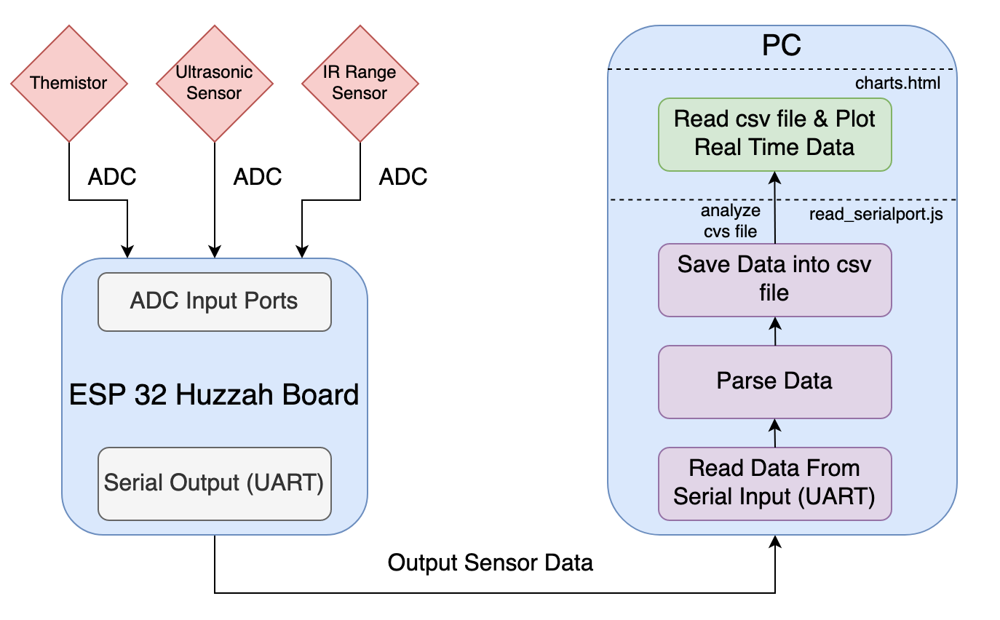
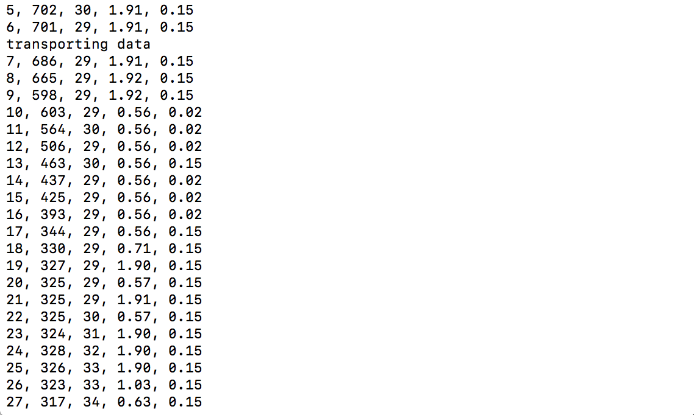
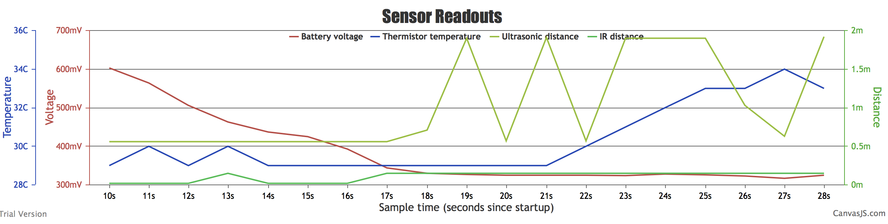

# Tactile Internet
Author: Chen-Yu Chang, Hairuo Sun

Date: 2020-10-08
-----

## Summary
In this quest, we connected the 3 sensors(thermistor, ultrasonic sensor, IR range sensor) to the ESP32 using ADC, and output these sensor values and graph them on a localhost:8080 to build a tactile Internet. The three sensors output values into ESP32's ADC ports every 2 seconds once this microcontroller is flashed. Then, when running the read_serialport.js file, sensor values are read through esp32's uart port. Next, sensor values are parsed and saved into a .csv file. Finally, charts.html file read the .csv file, graphs all sensor values onto the same chart, which is updated in real time every 2 seconds.

## Self-Assessment

### Objective Criteria

| Objective Criterion | Rating | Max Value  |
|---------------------------------------------|:-----------:|:---------:|
| Objective One | 1 |  1     |
| Objective Two | 1 |  1     |
| Objective Three | 1 |  1     |
| Objective Four | 1 |  1     |
| Objective Five | 1 |  1     |
| Objective Six | 1 |  1     |
| Objective Seven | 1 |  1     |

### Qualitative Criteria

| Qualitative Criterion | Rating | Max Value  |
|---------------------------------------------|:-----------:|:---------:|
| Quality of solution | 5 |  5     |
| Quality of report.md including use of graphics | 3 |  3     |
| Quality of code reporting | 3 |  3     |
| Quality of video presentation | 3 |  3     |

## Solution Design

 Design Solution Graph 

 
 
 

## Investigative Question
### Question:
Tabulate and compare the accuracy and speed of the IR and ultrasonic sensors. Which one would you prefer to use to support driving a robotic car?

### Answer:
#### Testing Distance
0.5 meter

#### Speed
| Ultrasonic Speed (m/s)| IR Speed (m/s)      |
|---------------------------------------------|:-----------:|
| 340 |  3 x 10^8     |

#### Console Output of Sensor Distance
| Ultrasonic Distance (m) | IR Distance (m)      |
|------------------------------------------------|:-----------:|
| 0.56 |  0.04     |
| 0.57 |  0.15     |
| 0.58 |  0.15     |
| 0.59 |  0.15     |
| 0.61 |  0.15     |

#### Explain:
From values we obtained above, ultrasonic sensor distance value is much closer to our testing distance 0.5 meter.

For robotic cars, we would choose ultrasonic sensor instead of ir sensor since ir sensor has a lot of limitations. It can make outdoor applications or dark indoor applications difficult. Ultrasonic sensors work using sound waves, detecting obstacles is not affected by as many factors. However, it will be better to use both of them at the same time.

## Sketches and Photos

  

 

 Sensor Circuit 

 
 
 

 Console Output 

 
 
 

 Output Chart 

 
 
 

## Supporting Artifacts
Repo Link: https://github.com/BU-EC444/Team12-Sun-Chang

Youtube Link: https://www.youtube.com/watch?v=gSv4wySG3T8

Tactile Internet Presentation

## Modules, Tools, Source Used Including Attribution
* Thermistor
* Ultrasonic sensors
* IR Range Sensor
* Node.js
* CanvasJS
* Javascript
* HTML
* ADC
* UART
* Timer
* RTOS
* esp32 Huzzah Board

## References
* [esp adc 1 example code](https://github.com/espressif/esp-idf/blob/39f090a4f1dee4e325f8109d880bf3627034d839/examples/peripherals/adc/main/adc1_example_main.c)
* [esp adc guide](https://docs.espressif.com/projects/esp-idf/en/latest/esp32/api-reference/peripherals/adc.html)
* [Thermistors/Temperature Measurement with NTC Thermistors](https://www.jameco.com/Jameco/workshop/TechTip/temperature-measurement-ntc-thermistors.html)
* [Ultrasonic sensor with esp32](https://www.instructables.com/ESP32-With-Ultrasonic-Sensor/)
* [IR sensor with esp32](https://protosupplies.com/product/sharp-gp2y0a02yk0f-ir-distance-measuring-sensor-module/)
* [Node.js tutorial](https://www.w3schools.com/nodejs/default.asp)
* [IOT sensor with esp32 and node.js](https://www.twilio.com/blog/2018/07/watch-iot-sensors-esp32-javascript-nodejs-twilio-sync.html)
* [Creating Charts from CSV](https://canvasjs.com/docs/charts/how-to/create-charts-from-csv/)
* [
CanvasJS](

https://canvasjs.com/javascript-charts/)
* [CanvasJS stacked-column chart](

https://canvasjs.com/javascript-charts/stacked-column-chart/)


-----
