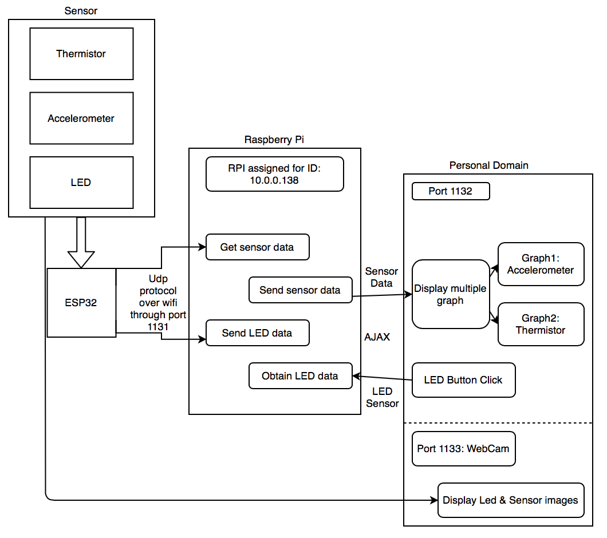
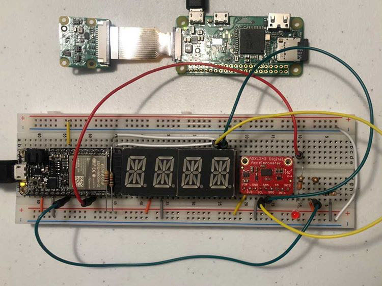
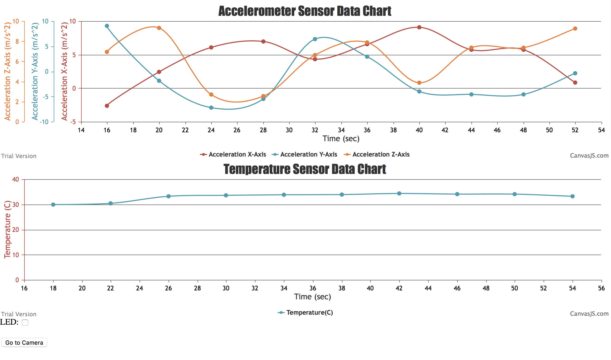

# Quest Name: Hurricane Box

Authors: Chen-Yu Chang, Hairuo Sun

Date: 2020-10-27
-----

## Summary
In this quest, we connected the thermistor and accelerometer sensors to the ESP32 by using ADC, and connected the led with ESP32 using GPIO pins. The sensors output values are read into ESP32's ADC ports every 2 seconds once this microcontroller is flashed. Then, we send the sensor data through udp protocol over wifi from ESP32 to RPI. RPI IP is 10.0.0.138, and the udp protocol used Port 1131 for data transmission. In addition, LED status is data is received through udp protocol to turn ON/OFF the led light.

We run the canvas_ajax.js file (server side) so that sensor values obtained through udp protocol are parsed and transmitted as an array using the "express" module's "get" from the server to the client. "Express" module's "post" method is used to receive led ON/OFF status data. Once again, UDP protocol is used to send back the led data to the esp32 over wifi.

After running canvas_ajax.js file, we accessed the sensor_ajax.html (client side) through "get" method as well. To access the html page, we used port 1132, and the RPI camera page is set to port 1133. Since we have used DDNS and port forwarding, the html page can be accessed at "hrsun.ddns.net:1132" and there is a camera link button on this page that will take us directly to "hrsun.ddns.1133" to observe the physical devices. JQuery AJAX protocol is used in the html file to receive sensor data from the server. 2 Graphs (Accelerometer & Thermistor Graphs) are created on the html page to display the 2 sensor value separately, and sensors' new data are continuously pushed into a global array to update the graph. Once the LED Button is clicked, the led status data will be send back to the server using AJAX protocol as well.

## Self-Assessment

### Objective Criteria

| Objective Criterion | Rating | Max Value  |
|---------------------------------------------|:-----------:|:---------:|
| Objective One | 1 |  1     |
| Objective Two | 1 |  1     |
| Objective Three | 1 |  1     |
| Objective Four | 1 |  1     |
| Objective Five | 1 |  1     |
| Objective Six | 1 |  1     |
| Objective Seven | 1 |  1     |

### Qualitative Criteria

| Qualitative Criterion | Rating | Max Value  |
|---------------------------------------------|:-----------:|:---------:|
| Quality of solution | 5 |  5     |
| Quality of report.md including use of graphics | 3 |  3     |
| Quality of code reporting | 3 |  3     |
| Quality of video presentation | 3 |  3     |

## Solution Design

 Design Solution Graph 

 
 
 

In this hurricane box, it can be basically distributed into several tasks and steps:

1. We connected the sensors, thermistor, accelerometer, and LED, and WebCam on the circuit board to ESP32.

2. All the data will be transmitted to ESP32

3. Data is then transmitted from esp32 to RPI using udp protocol over wifi. RPI is set to fixed internal IP:10.0.0.138, and the transmission is using port 1131. We also used port forwarding on the raspberry pi so that anyone can access its IP through domain "hrsun.ddns.net" that we created through ddns.

4. After receiving the data, we parsed the comma separated sensor data string into an array of sensor data string and send the sensor data to the personal domain (html file).

5. Through Express & JQuety Ajax method, we can deliver the data into the personal domain. In port 1132, we made two graphs(accelerometer and thermistor) that shows the change of data. When data is transmitted, we parsed it into float so that we can input the data we want into the graph.

6. On this html page, there is also a LED checkbox that can be clicked. Once its clicked/un-clicked, LED data signal is sent back to server using AJAX again, and then sent back to esp32 using udp protocol. As a result, LED will be turned on/off after clicking/un-clicking it.

7. Lastly, there is a button with a link that connect user to the same IP address but with different port number: port 1133. The port shows what the WebCam captures directly from ESP32.

## Investigative Question
### Question: What are steps you can take to make your device and system low power?

There are several ways to lower the power of our systems. We could make the device transmit and receive information only when necessary, limiting connection time. Furthermore, we could tune the parameters to optimize the performance and power consumption.

Source: https://blog.nordicsemi.com/getconnected/low-power-design-for-industrial-iot

## Sketches and Photos

  

 

 Sensor Circuit 

 
 
 

 Output Chart 

 
 
 

## Supporting Artifacts
- Repo Link: https://github.com/BU-EC444/Team12-Sun-Chang
- Youtube Link: https://www.youtube.com/watch?v=wANR_LoN2JY

Hurricane Box Presentation

## Modules, Tools, Source Used Including Attribution
* Thermistor
* Accelerometer
* WebCam
* Node.js
* CanvasJS
* Javascript
* HTML
* ADC
* UART
* Raspberry pi
* LED
* Esp32 Huzzah Board
* Wifi
* DDNS
* UDP
* Ajax

## References
* [UDP Client example](https://github.com/espressif/esp-idf/tree/master/examples/protocols/sockets/udp_client)
* [UDP Server-Client implementation in C](https://www.geeksforgeeks.org/udp-server-client-implementation-c/)
* [Return a String from a C Function](https://flaviocopes.com/c-return-string/)
* [sprintf in C](https://www.geeksforgeeks.org/sprintf-in-c/)
* [C library function - strncmp()](https://www.tutorialspoint.com/c_standard_library/c_function_strncmp.htm)
* [I2C Brief](http://whizzer.bu.edu/briefs/design-patterns/dp-i2c)
* [ADXL343 Base Code](https://github.com/BU-EC444/code-examples/tree/master/i2c-accel/main)
* [ESP32 I2C example - ESP32 as master, an I2C device as slave](https://gist.github.com/mws-rmain/2ba434cd2a3f32d6d343c1c60fbd65c8)
* [ADXL343 Datasheet](https://cdn-learn.adafruit.com/assets/assets/000/070/556/original/adxl343.pdf?1549287964)
* [Adafruit Learn Guide on the ADXL343](https://learn.adafruit.com/adxl343-breakout-learning-guide/overview)
* [Tilt Sensing](https://wiki.dfrobot.com/How_to_Use_a_Three-Axis_Accelerometer_for_Tilt_Sensing)
* [ESP32 WiFi Station Example Code](https://github.com/espressif/esp-idf/tree/master/examples/wifi/getting_started/station)
* [Configuring ddclient to update your dynamic DNS at noip.com](https://www.andreagrandi.it/2014/09/02/configuring-ddclient-to-update-your-dynamic-dns-at-noip-com/)
* [Xfinity Port forwarding Setup Guide](https://www.xfinity.com/support/articles/port-forwarding-xfinity-wireless-gateway)
* [Creating Charts from CSV](https://canvasjs.com/docs/charts/how-to/create-charts-from-csv/)
* [Visualization Brief](http://whizzer.bu.edu/briefs/design-patterns/dp-visual)
* [Stock Closing Price Data](http://whizzer.bu.edu/skills/stocks-csv.txt)
* [JavaScript Multi Series Charts & Graphs](https://canvasjs.com/javascript-charts/multi-series-chart/)
* [JavaScript Line Charts & Graphs](https://canvasjs.com/html5-javascript-line-chart/)
* [Setinverval JS function](https://www.w3schools.com/jsref/met_win_setinterval.asp)
* [JQuery $(document).ready(function())](https://api.jquery.com/ready/)
* [JavaScript Line Charts & Graphs](https://canvasjs.com/html5-javascript-line-chart/)
* [DataloadingTest Example Code for AJAX](https://github.com/BU-EC444/code-examples/tree/master/DataLoadingTest)
* [Window setInterval() Method](https://www.w3schools.com/jsref/met_win_setinterval.asp)
* [Hide Unhide Data Series on Legend Click](https://canvasjs.com/docs/charts/how-to/hide-unhide-data-series-chart-legend-click/)
* [JavaScript String split() Method](https://www.w3schools.com/jsref/jsref_split.asp)
* [jQuery ajax() Method](https://www.w3schools.com/jquery/ajax_ajax.asp)
* [JavaScript parseFloat() Function](https://www.w3schools.com/jsref/jsref_parsefloat.asp)
* [jQuery load() Method](https://www.w3schools.com/jquery/ajax_load.asp)
* [jQuery - AJAX get() and post() Methods](https://www.w3schools.com/jquery/jquery_ajax_get_post.asp)
* [JSON Objects](https://www.w3schools.com/js/js_json_objects.asp)
* [Remove question mark at the end of the URL](https://stackoverflow.com/questions/32925503/remove-question-mark-at-the-end-of-the-url)
* [Portable Video Streaming Camera with Raspberry Pi Zero W](https://www.hackster.io/narender-singh/portable-video-streaming-camera-with-raspberry-pi-zero-w-dc22fd)

-----
