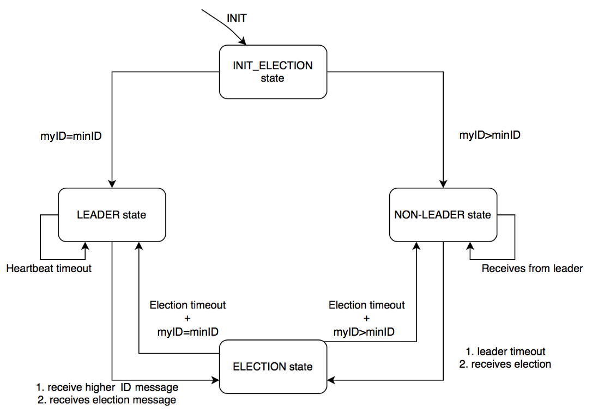
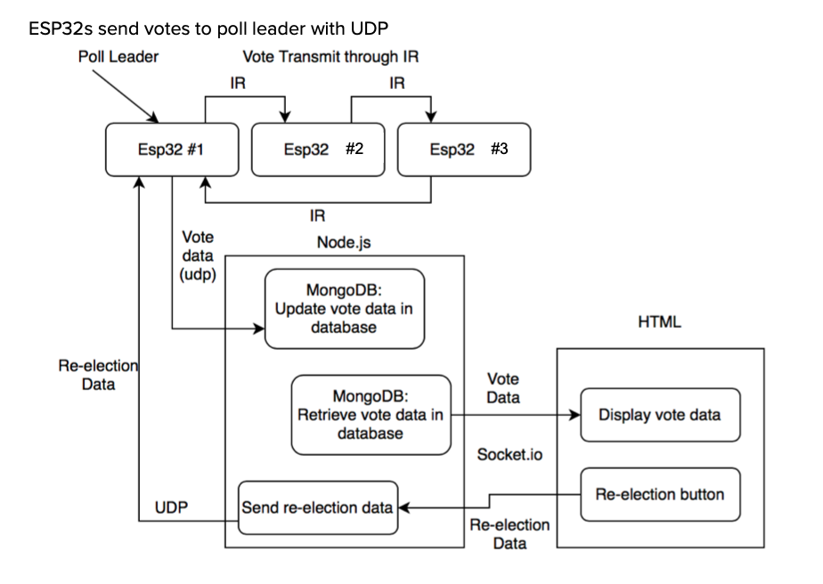
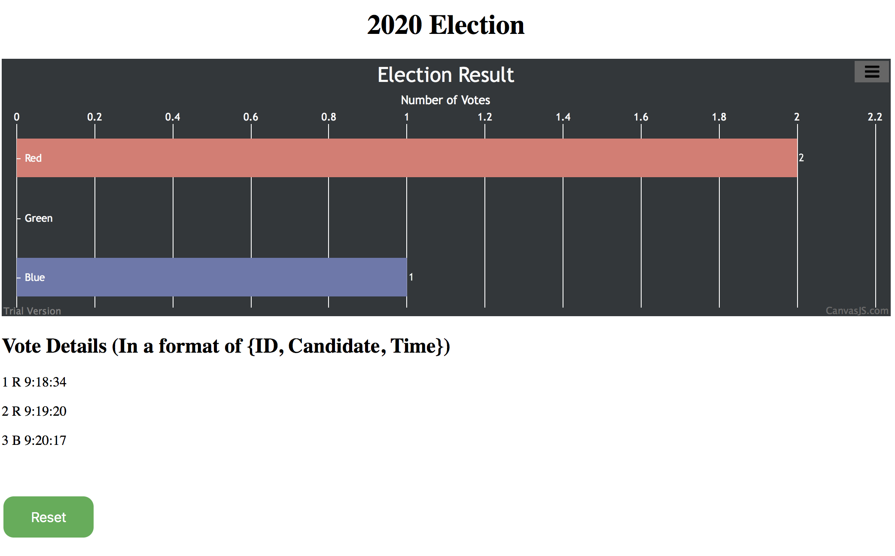
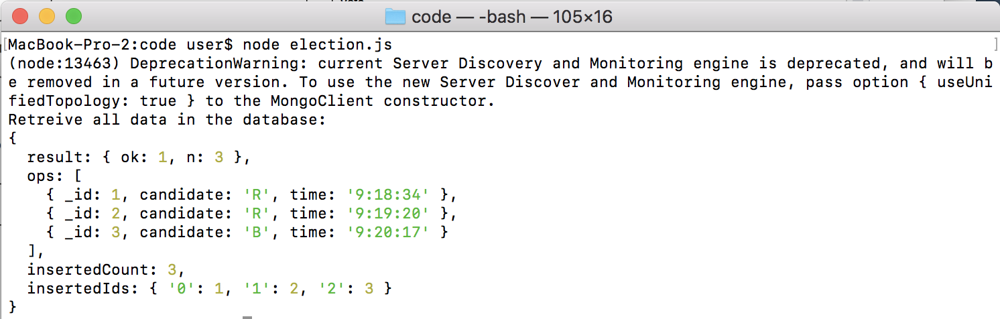

# Quest Name: Electronic Voting
Authors: Hairuo Sun, Chen-Yu Chang

Date: 2020-11-13
-----

## Summary
In this quest, e-voting will be enabled by unique devices (fobs) given to all registered voters. Voting will consist of creating a secure near field communications link between two fobs. There are in total of three fobs for voting. Original votes can only be communicated by a secure IR channel from one fob to another. Once the vote has been received, it should be communicated to the Poll Leader. It will send the results to a server which will log the vote to a database. Poll results will be accessible via the server via http, and there is a reset button that will restart the vote. Overall, this quest used IR TX/RX to select between Red, Green, Blue candidates. Furthermore, we got two buttons, one to select the LED candidate we want to choose, the other to send the final vote decision of the candidate.

## Self-Assessment

### Objective Criteria

| Objective Criterion | Rating | Max Value  |
|---------------------------------------------|:-----------:|:---------:|
| Objective One | 1 |  1     |
| Objective Two | 1 |  1     |
| Objective Three | 1 |  1     |
| Objective Four | 1 |  1     |
| Objective Five | 1 |  1     |
| Objective Six | 1 |  1     |
| Objective Seven | 1 |  1     |

### Qualitative Criteria

| Qualitative Criterion | Rating | Max Value  |
|---------------------------------------------|:-----------:|:---------:|
| Quality of solution | 5 |  5     |
| Quality of report.md including use of graphics | 3 |  3     |
| Quality of code reporting | 3 |  3     |
| Quality of video presentation | 3 |  3     |

## Solution Design

 FSM Design Solution Graph 

 
 
 

 System Design Solution Graph 

 
 
 

### Hardware:

  a. We got three esp32 for transmitting the vote data. Two belongs to Hairuo Sun and one belongs to Chen-Yu Chang (only has one because there is some problem with ddns setup and we used a new way, vpn, with the TA, and it turned out to be free for only one port to implement udp receiving and sending).

  b. We had three candidates to be chosen, Blue, Red, and Green, represented by three color LEDs. Furthermore, there are two buttons, one for choosing which candidate to vote and the other for sending the vote data through IR TX/RX.

  c. Leader Election LED representation of States: Green - Initial Election / Election; Red - Non_leaders; Blue - Leader.

### Software:

  a. We designed a FSM diagram for us to understand the transition of different states.
  1. The initial state was the first state when starting the program. Depending on the ID and the minimumID, one of the esp32s can be chosen as the poll leader. If myID is larger than the minimum ID, the esp32 will transfer into NON-LEADER state, while when myID is equal to the minimum ID, it shift to the LEADER state.
  2. The poll leader also send non-leaders messages when "heartbeat timeout" and stay in leader state if no election messages are received. If the leader receives the messages from lower/higher ID esp32s asking for re-election, it will transition to the ELECTION state.
  3. The non-leader esp32s will receives data from leader and stay in non-leader state if it receives leader message before "leader timeout". However, it will shift to ELECTION state if "leader timeout" or if it receives election messages from other lower/higher ID esp32s.
  4. In ELECTION state, higher ID esp32s send lower ID esp32s election message. If higher ID esp32s receives "ok" confirmation from lowerID esp32s, higher ID esp32s set their next state as non_leader. If an esp32 doesn't receive any "ok" confirmation, it set its next state as leader. Then, once the election timeout, all esp32s transition to their respective next state.

  b. We created a C code for this quest. Upon voting (vote to a specific LED: Red, Green, Blue), one esp32 will transmit vote using IR to nearby esp32. Then, this adjacent esp32 will send vote data to poll leader using UDP, and the format of vote message is "VoterID CandidateColor" to the Node.js file. In the node.js file, we put all the data received as a 2D array into a database using MongoDB. It updates the vote data and retrieves the vote data. In addition, we get the recent time using unix timestamp whenever a vote is received and then stored into the 2D in the database. For retrieving timestamp, we used special formulas to change the original time data into readable string format, such as "10:30:23". After data is retrieved, it will be transmitted through socket.io to html that will display the all vote data and show the detail information of the voting situation, such as id, candidate, and timestamp. The chart will combine the total votes for the candidates and show it through a bar chart, which can obviously show who the winner is. Finally, node.js also used to send back the signal of re-election of candidates after pressing the reset button in the html browser.

### Additional Technical Details' Explanation:
Note: All technical details can be found either in demo video or in images shown below. This is an additional explanation of our technical details' implementation. Console display shows messages of 2 different color: white and green. White represents printf messages, green represent esp32 LOG messages. Please focus more on the messages with "white color" for leader election, vote transmission and receiving.

1. IR: adjacent vote data transmission from "esp32 1" to "esp32 2", from "esp32 2" to "esp32 3", and from "esp32 3" to "esp32 1". Note: in the image named "Electronic Voting Circuit" below, each esp32 are labeled as "esp32 [x]" and all IR transmitters and receivers are positioned in close proximity for optimal data transmission and receive. LED Color change can represent the transmission of the vote.
2. UDP vote transmission to Poll Leader: once adjacent voting is done, vote is transmitted from this adjacent esp32 to Poll leader through UDP. Transmission of the vote is indicated both by LED and on the Console. LED change is indicated in the video. Once a vote is transmitted from an esp32 to a poll leader, poll leader's color, if different, also changes to match the vote color received. Console Display also indicates that vote has been received by the leader.
3. Poll Leader Failure: If a poll leader fails, all esp32 goes into "election state" and all LED turn to Green. After election is done, the esp32 with the next min ID will become the new leader, go into "leader state' and its led color turns Blue (just like the way America turns blue again with our new president-elect: Joe Biden), and all other esp32 go into "non_leader state" and its led color turn Red. However, if the old leader come back, all esp32 went back to election again and elect the old leader as the new leader. Leader Election failure and recover is indicated in the video attached below both on the console and throgh LED presentation.
4. Poll Leader Report Votes: once vote is transmitted from adjacent esp32 to poll leaer, the poll leader transmitted this vote to node.js server right away. This can be seen in the video below showing console display. The console will show "Poll Leader received vote.", then it follows with "Vote is sent to Node.js Database!". Note: in the .c code, "esp32 1" id is 0, "esp32 2" id is 2, "esp32 3" id is 2. However, when we transmit the final esp32 IDs to the node.js file, we add 1 to each id to match with the normal esp32's number labeled in the image "Electronic Voting Circuit" and the Database voter ID in image "Database Retrieve" shown below.
5. Query to Database: The image "Database Retrieve" shown below represents the query to mongodb database displaying vote for each candidate.
6. As explained previously, we were only able to use 3 esp32s because of problem with ddns setup. For more detailed explanation, refer to the above "Hardware" section.

## Investigative Question
### Question: List 5 different ways that you can hack the system (including influencing the vote outcome or prevenging votes via denial of service). For each above, explain how you would mitigate these issues in your system.

#### Attacks

First, man-in-the-middle attack is one way. It is a cyberattack where the attacker secretly relays and possibly alters the communications between two parties who believe that they are directly communicating with each other. Next, denial of service attack is another common attack. Dos attack occurs when legitimate users are unable to access information systems, devices, or other network resources due to the actions of a malicious cyber threat actor. It is accomplished by flooding the targeted host or network with traffic until the target cannot respond or simply crashes, preventing access for legitimate users. SQL injection is also an attack when an attacker inserts malicious code into a server that uses SQL and forces the server to reveal information it normally would not. DNS tunneling utilizes the DNS protocol to communicate non-DNS traffic over port 53. It sends HTTP and other protocol traffic over DNS. Last, Malware is another common cyberattack. Malware breaches a network through a vulnerability, typically when a user clicks a dangerous link or email attachment that then installs risky software.

#### Mitigation

The way to avoid man-in-the-middle attack is to establish some certificate and public key agreement protocol, which is able to make sure the message is genuine. For denial of service attack, we can avoid by only connecting one thread to blink the LED, and restart every time the massage is received. We could increase the time between each message so that the microcontroller will only process one message at a time, which solve the problem of processing too many messages at a time. Furthermore, we can solve the problem of unknown endpoint database by making the system more secured by including the database and having the server perform queries to fetch data when a certain ID is connected so that when typing the address of the endpoint, it will not show the data to all the users. By preventing Malware, we can only allow the authorized devices, which are pre-approved only should be allowed to connect to main systems. Last, to prevent from SQL injection attack, the validation process is aimed at verifying whether or not the type of input submitted by a user is allowed. Only the value which passes the validation can be processed. To avoid DNS tunneling, a tool must be installed that blacklists the destinations which are to extract data. This activity must be done on a regular basis.A DNS firewall should be configured and designed such that it quickly identifies any intrusion. A firewall serves as a pathway for exfiltration.

Source:

Common Cyberattack:

https://www.cisco.com/c/en/us/products/security/common-cyberattacks.html#~how-cyber-attacks-work

Malware Mitigation:

https://gradesfixer.com/free-essay-examples/best-practice-to-employ-to-mitigate-malware-effects-on-a-machine/

SQL Injection Attack:

https://www.ptsecurity.com/ww-en/analytics/knowledge-base/how-to-prevent-sql-injection-attacks/

Man-in-the-middle Attack:

https://en.wikipedia.org/wiki/Man-in-the-middle_attack

DOS Attack:

https://us-cert.cisa.gov/ncas/tips/ST04-015

DNS Tunneling:

https://www.hitechnectar.com/blogs/prevent-dns-tunneling/

## Sketches and Photos

  

 

 Electronic Voting Circuit 

 
 
 

 Output Chart 

 
 
 

 Database Retrieve 

 
 
 

## Supporting Artifacts
- Repo Link: https://github.com/BU-EC444/Team12-Sun-Chang
- Youtube Channel: https://www.youtube.com/channel/UCsBSAEOsmIpEFN5RkCl7lYg?view_as=subscriber

Electronic Voting Demo

Electronic Voting Presentation

## Modules, Tools, Source Used Including Attribution
* Button
* Rtos
* IR Transceiver
* IR LED
* MongoDB
* ESP32
* LED
* Database
* Wifi
* Node js
* HTML
* JavaScript
* Canvasjs
* C
* Socket.io
* UDP
* DDNS
* Port Forwarding

## References
* [IR TX/RX Manual](http://whizzer.bu.edu/skills/ir-tx-rx)
* [TSOP38238 Datasheet](https://www.sparkfun.com/datasheets/Sensors/Infrared/tsop382.pdf)
* [traffic-light-ir-example code](https://github.com/BU-EC444/code-examples/blob/master/traffic-light-ir-example/main/ir-car-beacon.c)
* [IR Communications Design Pattern](http://whizzer.bu.edu/briefs/design-patterns/dp-irtxrx)
* [Design Pattern – Databases + Visualization](http://whizzer.bu.edu/briefs/design-patterns/dp-db)
* [Node.js MongoDB](https://www.w3schools.com/nodejs/nodejs_mongodb.asp)
* [js - read tab delimited file line by line](https://stackoverflow.com/questions/28927640/javascript-read-tab-delimited-file-line-by-line-than-split-each-line-using-ta)
* [Read Files with Node.js](https://stackabuse.com/read-files-with-node-js/)
* [Node.js MongoDB Insert](https://www.w3schools.com/nodejs/nodejs_mongodb_insert.asp)
* [Node.js MongoDB Find](https://www.w3schools.com/nodejs/nodejs_mongodb_find.asp)
* [Bully Algorithm](https://en.wikipedia.org/wiki/Bully_algorithm)
* [Bully Algorithm Coursera](https://www.coursera.org/lecture/cloud-computing-2/1-4-bully-algorithm-K8QwJ)
* [UDP client example code](https://github.com/espressif/esp-idf/tree/master/examples/protocols/sockets/udp_client)
* [UDP server example code](https://github.com/espressif/esp-idf/tree/master/examples/protocols/sockets/udp_server)
* [C library function - strtok](https://www.tutorialspoint.com/c_standard_library/c_function_strtok.htm)
* [Split a string into tokens - strtok](https://www.codingame.com/playgrounds/14213/how-to-play-with-strings-in-c/string-split)
* [Need multiple connections in C socket](https://stackoverflow.com/questions/10630149/need-multiple-connections-in-c-socket)
* [Leader Election slides 1 from Whizzer](http://whizzer.bu.edu/progress/ppts/e-voting-cluster4)
* [Leader Election slides 2 from Whizzer](http://whizzer.bu.edu/progress/ppts/bully)

-----
