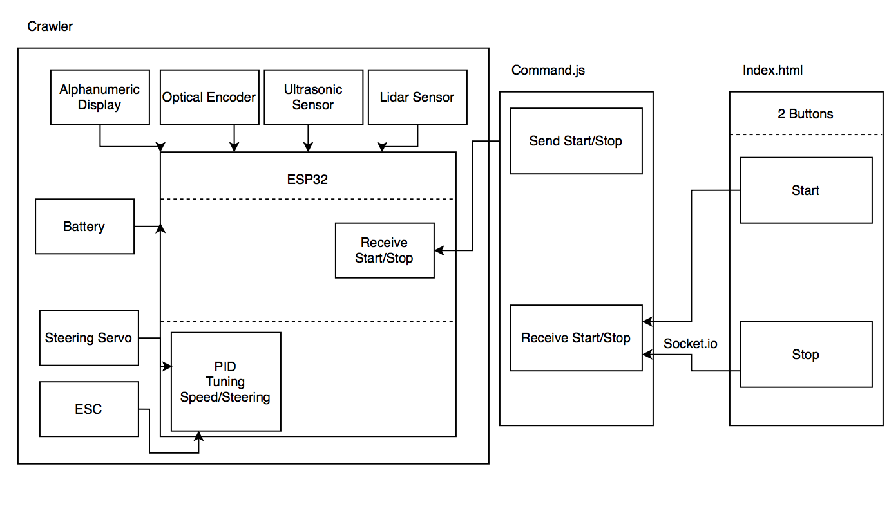
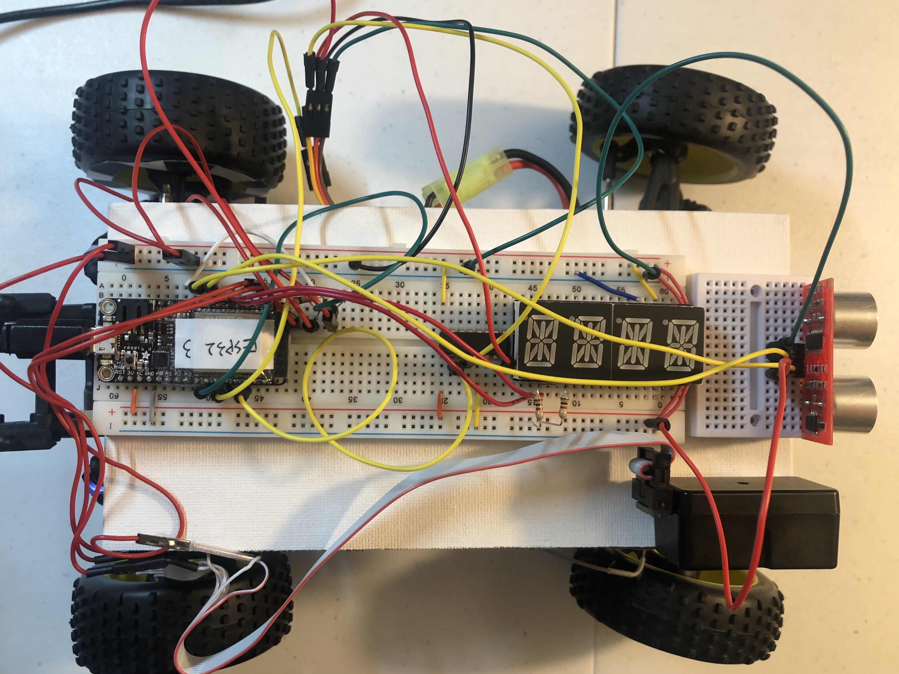

# Quest Name: Cruise Control
Authors: Hairuo Sun, Chen-Yu Chang

Date: 2020-12-01
-----

## Summary
In the quest, we connected the crawler, range sensors, esc & steering servos, optical encoder to esp32, and used udp &8 socket.io to implement cruise control on the crawler, making it an autonomous vehicle. We utilized three sensors(Lidar v4, IR RangeFinder, and Ultrasonic Sensor) around the crawler for detecting the distance between the obstacles and the car so that it does not crash. We also used an optical encoder to measure the crawler speed. Our goal is to drive the crawler along a designated straight line, maintaining a constant speed of 0.1 - 0.4 m/s. The system also needs to rely on PID control to control both the speed and the steering. Finally, the crawler needs to stop within 20cm of an obstacle or the end of the road. We tuned all sensors and PID control to achieve these goals. We also set up a html client with start/stop buttons to press on and use socket.io to send to a command.js server, which then sends to esp32 through udp to start/stop the crawler forward movement and PID tuning. The vehicle is controlled in wireless mode.

Note: For the crawler constant speed, we choose 1m/s because this is the lowest speed that our crawler is able to start moving. However, this doesn't affect our crawler performance. In fact, it smoothes out our crawler forward motion so that our crawler doesn't unexpectedly stop moving in the middle of the cruise control.

## Self-Assessment

### Objective Criteria

| Objective Criterion | Rating | Max Value  |
|---------------------------------------------|:-----------:|:---------:|
| Objective One | 1 |  1     |
| Objective Two | 1 |  1     |
| Objective Three | 1 |  1     |
| Objective Four | 1 |  1     |
| Objective Five | 1 |  1     |
| Objective Six | 1 |  1     |
| Objective Seven | 1 |  1     |

### Qualitative Criteria

| Qualitative Criterion | Rating | Max Value  |
|---------------------------------------------|:-----------:|:---------:|
| Quality of solution | 5 |  5     |
| Quality of report.md including use of graphics | 3 |  3     |
| Quality of code reporting | 3 |  3     |
| Quality of video presentation | 3 |  3     |

## Solution Design

 Design Solution Graph 

 
 
 

For this solution. We have 3 sections: 1) Sensor measurements 2) PID tuning 3) wireless control.

1. 3 range sensors(ultrasonic, IR, lIDAR sensors) and 1 optical encoder (optical emitter/phototransistor) are used. LIDAR is very accurate and is used to measure the distance between front wheel and the wall. LIDAR is also used for distance PID tuning to help the car maintain at a center line. The ultrasonic sensor / IR sensor are used to measure the distance between the car and its closest obstacle ahead. However, both ultrasonic sensor and IR sensor are not as accurate as the LIDAR sensor; although IR sensor is a bit more accurate, a lot of sensor tuning (using a ruler & excel sheet plot) have been done for both sensors to obtain the best equation to match actual distance with sensor output distance. Eventually, we used IR sensor to measure the distance between the car and the obstacle ahead. The optical encoder is used to measure encoder pattern values on the back wheel to calculate the car speed.

2. Steering Servo and ESCs are also connected between the crawler and the ESP32. 2 PID functions are used to tune the steering direction and speed of the crawler.

3. To control the crawler forward movement, 2 buttons (start & stop buttons) are implemented in an html file. Upon button clicking, corresponding button click information (start/stop instructions) are sent to command.js file through socket.io, and then from command.js file to esp32 through udp protocol. Once the car receives start/stop instruction, it will start/stop the forward movement & PID tuning immediately.

## Investigative Question
### Question: How would you change your solution if you were asked to provide ‘adaptive’ cruise control?

The adaptive systems rely on several accurate sensors, along with a camera that are mounted within the front of the car, serving as our car’s eyes. They work individually and sometimes in concert with each other to continually scan the road ahead of us for vehicles, obstacles, and changes in traffic flow. In the code, we will add more state machines to provide the car more options to adapt to the car's situation, including full stop, acceleration, and maintainability.

Source: https://fixautousa.com/blog/everything-about-adaptive-cruise-control/

## Sketches and Photos

  

 

 Cruise 

 
 
 

 Cruise 

 
 
 

## Supporting Artifacts
- Repo Link: https://github.com/BU-EC444/Team12-Sun-Chang
- Youtube Link: https://www.youtube.com/watch?v=fnhgWvOUKMY

Cruise Control Presentation

## Modules, Tools, Source Used Including Attribution
* Crawler
* H Bridge
* Buggy ESC
* ESP32
* Lidar v4
* Optical Encoder
* Wifi
* Ultrasonic Sensor
* Alphanumeric Display
* IR RangeFinder
* Node js
* PID
* HTML
* JavaScript
* C
* Socket.io
* UDP
* DDNS
* Port Forwarding

## References
* [ESC Design Pattern](http://whizzer.bu.edu/briefs/design-patterns/dp-esc-buggy)
* [ESP Example Code for Servo](https://github.com/espressif/esp-idf/tree/master/examples/peripherals/mcpwm/mcpwm_servo_control)
* [Buggy ESC User Manual](https://www.hobbywing.com/products/enpdf/QuicRunWP1625-WP860-WP1060.pdf)
* [Buggy PPT Slides](http://whizzer.bu.edu/progress/ppts/buggy-cluster1)
* [Garming Lidar v4 Datasheet](http://static.garmin.com/pumac/LIDAR-Lite%20LED%20v4%20Instructions_EN-US.pdf)
* [Garming Arduino Examples](https://github.com/garmin/LIDARLite_Arduino_Library)
* [LIDAR PPT Slides](http://whizzer.bu.edu/progress/ppts/buggy-cluster2)
* [How to Strip Ribbon Cable](https://electronics.stackexchange.com/questions/82054/how-to-strip-a-ribbon-cable)
* [Wheel Speed PPT Slides](http://whizzer.bu.edu/progress/ppts/buggy-cluster2)
* [Sparkfun Guide to Optical Encoder](https://learn.sparkfun.com/tutorials/qrd1114-optical-detector-hookup-guide#example-circuit)
* [ESP32 Pulse Counter](https://docs.espressif.com/projects/esp-idf/en/latest/esp32/api-reference/peripherals/pcnt.html)
* [ESP32 Encoder Template](http://whizzer.bu.edu/images/encoder.gif)
* [PID Class PPT](http://whizzer.bu.edu/progress/ppts/buggy-cluster3)
* [PID Design Pattern](http://whizzer.bu.edu/briefs/design-patterns/dp-pid)
* [IR sensor with esp32](https://protosupplies.com/product/sharp-gp2y0a02yk0f-ir-distance-measuring-sensor-module/)
* [esp adc 1 example code](https://github.com/espressif/esp-idf/blob/39f090a4f1dee4e325f8109d880bf3627034d839/examples/peripherals/adc/main/adc1_example_main.c)
* [esp adc guide](https://docs.espressif.com/projects/esp-idf/en/latest/esp32/api-reference/peripherals/adc.html)
* [io.on issue](https://stackoverflow.com/questions/41623528/io-on-is-not-a-function)
* [Socket.IO Intro](https://socket.io/docs/v3/index.html)

-----
