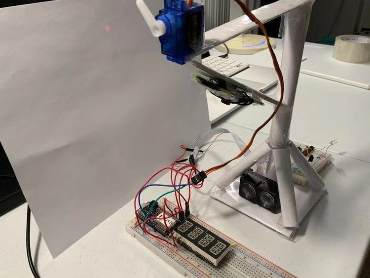

# Quest Name: Smoothie Dispenser

Authors: Chen-Yu Chang, Hairuo Sun

Date: 2020-12-10
-----

## Summary

Smoothie Dispenser is a remote food drop system that consumers can use to drop smoothie onto smoothie container by pressing a remote button on their phone; afterwards, customers can obtain the smoothie from the smoothie container. The main process includes 5 steps: 1) place the smoothie container at smoothie drop zone. 2) observe the LIDAR distance and box location through WebCam. 3) observe the accelerometer data when stabilizes. 4) we click the drop button, and then the temperature decreases. 5) the customer can take the smoothie away.

We use 2 actuators, 3 sensors and a RPI WebCam to implement this dispensing system. We used a servo for dropping food, a LIDAR sensor for determining the distance between the drop zone and the food container, an alphanumeric display for displaying the LIDAR value, a thermistor for determining the smoothie temperature and an accelerometer for determine if the food container is being moved or staying still.

We wrote two main c code (food_container.c and drop_food.c) for two esp32s. We transmit the data of thermistor and accelerometer through udp to the node.js file. The node.js file transmit data through ajax to the html and display the dynamic graph on the server. There is also a push button that sends "drop" instruction data back to node.js using socket.io, and then back to esp32 using udp; the "drop" instruction will trigger the servo to drop the smoothie.

## Self-Assessment

### Objective Criteria

| Objective Criterion | Rating | Max Value  |
|---------------------------------------------|:-----------:|:---------:|
| Objective One | 1 |  1     |
| Objective Two | 1 |  1     |
| Objective Three | 1 |  1     |
| Objective Four | 1 |  1     |
| Objective Five | 1 |  1     |
| Objective Six | 1 |  1     |
| Objective Seven | 1 |  1     |

### Qualitative Criteria

| Qualitative Criterion | Rating | Max Value  |
|---------------------------------------------|:-----------:|:---------:|
| Quality of solution | 5 |  5     |
| Quality of report.md including use of graphics | 3 |  3     |
| Quality of code reporting | 3 |  3     |
| Quality of video presentation | 3 |  3     |

## Solution Design
 
 
 
 
 
 
 
 
 

 Solution Design 

 
 
 
 
 
 
 
 
 

### Solution Explanation
There are 4 components in this solution design:
1. ESP32 1 Food Dispenser: It contains an actuation device using a servo to drop food from above into the food container below. It also has a LIDAR sensor attached to the food dispenser station to determine if there is any food container nearby, and if there is, it determines how far is the container. Then, an alphanumeric display connected to this ESP32 1 device will display LIDAR distance data to indicate the distance of food container. Finally, an RPI camera is attached on the food dispenser to monitor the LIDAR value on Alphanumeric display, to ensure that the food container is at the drop zone and to show if the food is dropped into the food container.
2. ESP32 2 Food Container: 2 sensors are connected to the food container. The first sensor is the thermistor, which will determine the food temperature. The second sensor is the accelerometer, which will determine if the food container is being moved or staying still. During "staying still" period, if the food container is nearby, we can initiate the remote process to drop food into the container.
3. Node.js server: It is used to transmit 2 kinds of data: two sensors' data (thermistor & accelerometer data) and "drop" instruction data. 1) two sensors' data is transmitted from ESP32 2 to ESP32 1 then to node.js file using UDP protocol. 2) Food "drop" instruction data is transmitted from node.js file through UDP protocol back to ESP 32 1. It initiates the "drop" process so that servo can drop food into the food container.
4. html client has 3 parts: 1) Food "drop" button, once pressed, will transmit food "drop" instruction data to node.js server through AJAX. 2) Two sensors' data graph: accelerometer & thermistor sensors. 3) Camera that shows the drop zone information: LIDAR value on alphanumeric display, food container location and whether food is dropped into the container.

### Functional Steps
Note: To show our functional steps, we specify the "smoothie container" as our food container, and "smoothie dispenser" as our food dispenser/food drop system.
1. Move the smoothie container into the smoothie dispenser zone. Since an accelerometer is attached to the smoothie container, and a RPI camera is pointing directly at the smoothie dispenser zone with a LIDAR sensor indicating how far the smoothie container is from the dispenser, we should observe the accelerometer graph & RPI camera on the HTML page to determine if the smoothie container has been correctly placed under the smoothie dispenser.
2. Once accelerometer's x, y & z values stabilize and alphanumeric display value, which is the LIDAR value, seen from the RPI camera is between 9 - 11cm, smoothie dispensing process can be started.
3. Press "DROP" button on the HTML webpage. Then, the "drop" instruction is sent out to spin the servo and drop the smoothie into the smoothie container. We used ice-cube to represent the idea of smoothie, and a thermistor is attached at the button of the smoothie container to measure the temperature of the smoothie (we want to maintain the low temperature of the smoothie).
4. Once the smoothie is dropped into the container, we should be able to observe 2 things: 1) the temperature in the "temperature" graph is dropping, 2) RPI camera shows the visual of the smoothie ("ice cube") is dropped into the smoothie container & ready for the customer.
5. Steps shown in the demo video below:
* Step 1: Place the smoothie container at smoothie drop zone. 

* Step 2: Observe LIDAR distance and box location on RPI CAM.

* Step 3: Observe Accelerometer data generally stabilizes.

* Step 4: Press “DROP” button.

* Step 5: Observe temperature decreases.

* Step 6: Customer can take smoothie container away.

## Sketches and Photos

  

 

 Smoothie Dispenser 

 
 
 

 Subsystem 

 
 
 

 Top View 

 
 
 

 Food Container 

 
 
 

 Graph Display 

 
 
 

 Webcam Livestream 

 
 
 

## Supporting Artifacts
- Repo Link: https://github.com/BU-EC444/Team12-Sun-Chang
- Youtube Link: https://www.youtube.com/watch?v=26NgU4h7F3A

Smoothie Dispenser Presentation

## Modules, Tools, Source Used Including Attribution
* Raspberrypi
* Webcam
* Accelerometer
* ESP32
* Lidar v4
* Thermistor
* Wifi
* Servo
* Alphanumeric Display
* Ajax
* Node js
* HTML
* JavaScript
* C
* Socket.io
* UDP
* DDNS
* Port Forwarding

## References
* [Garming Lidar v4 Datasheet](http://static.garmin.com/pumac/LIDAR-Lite%20LED%20v4%20Instructions_EN-US.pdf)
* [Garming Arduino Examples](https://github.com/garmin/LIDARLite_Arduino_Library)
* [LIDAR PPT Slides](http://whizzer.bu.edu/progress/ppts/buggy-cluster2)
* [How to Strip Ribbon Cable](https://electronics.stackexchange.com/questions/82054/how-to-strip-a-ribbon-cable)
* [Thermistors/Temperature Measurement with NTC Thermistors](https://www.jameco.com/Jameco/workshop/TechTip/temperature-measurement-ntc-thermistors.html)
* [esp adc 1 example code](https://github.com/espressif/esp-idf/blob/39f090a4f1dee4e325f8109d880bf3627034d839/examples/peripherals/adc/main/adc1_example_main.c)
* [esp adc guide](https://docs.espressif.com/projects/esp-idf/en/latest/esp32/api-reference/peripherals/adc.html)
* [I2C Brief](http://whizzer.bu.edu/briefs/design-patterns/dp-i2c)
* [ADXL343 Base Code](https://github.com/BU-EC444/code-examples/tree/master/i2c-accel/main)
* [ESP32 I2C example - ESP32 as master, an I2C device as slave](https://gist.github.com/mws-rmain/2ba434cd2a3f32d6d343c1c60fbd65c8)
* [ADXL343 Datasheet](https://cdn-learn.adafruit.com/assets/assets/000/070/556/original/adxl343.pdf?1549287964)
* [Adafruit Learn Guide on the ADXL343](https://learn.adafruit.com/adxl343-breakout-learning-guide/overview)
* [Tilt Sensing](https://wiki.dfrobot.com/How_to_Use_a_Three-Axis_Accelerometer_for_Tilt_Sensing)
* [esp example code for servos](https://github.com/espressif/esp-idf/tree/master/examples/peripherals/mcpwm/mcpwm_servo_control)
* [PWM Brief](http://whizzer.bu.edu/briefs/design-patterns/dp-pwm)
* [Alphanumeric Brief](http://whizzer.bu.edu/briefs/alphanumeric)
* [Alphanumeric I2C code](https://github.com/BU-EC444/code-examples/tree/master/i2c-display)
* [14-Segment Alpha-numeric LED featherwing](https://learn.adafruit.com/14-segment-alpha-numeric-led-featherwing/pinouts#address-jumpers-2-10)
* [SSH (Secure Shell)](https://www.raspberrypi.org/documentation/remote-access/ssh/)
* [Portable Video Streaming Camera with Raspberry Pi Zero W](https://www.hackster.io/narender-singh/portable-video-streaming-camera-with-raspberry-pi-zero-w-dc22fd)
* [How to connect a Picamera to a Pi ZERO](https://www.youtube.com/watch?v=zFAX4pH1BPA)
* [Detect RPI Cam](https://windowsreport.com/raspberry-pi-camera-not-detected/)
* [Detect RPI Cam Command](https://www.raspberrypi.org/forums/viewtopic.php?t=174375)
* [Node.js tutorial](https://www.w3schools.com/nodejs/default.asp)
* [IOT sensor with esp32 and node.js](https://www.twilio.com/blog/2018/07/watch-iot-sensors-esp32-javascript-nodejs-twilio-sync.html)
* [DataloadingTest Example Code for AJAX](https://github.com/BU-EC444/code-examples/tree/master/DataLoadingTest)
* [Creating Charts from CSV](https://canvasjs.com/docs/charts/how-to/create-charts-from-csv/)
* [Visualization Brief](http://whizzer.bu.edu/briefs/design-patterns/dp-visual)
* [Stock Closing Price Data](http://whizzer.bu.edu/skills/stocks-csv.txt)
* [JavaScript Multi Series Charts & Graphs](https://canvasjs.com/javascript-charts/multi-series-chart/)
* [Setinverval JS function](https://www.w3schools.com/jsref/met_win_setinterval.asp)
* [JQuery $(document).ready(function())](https://api.jquery.com/ready/)
* [JavaScript Line Charts & Graphs](https://canvasjs.com/html5-javascript-line-chart/)
* [Timer Interrupts Brief](http://whizzer.bu.edu/briefs/design-patterns/dp-timer)
* [esp example code on timer (1 second alarm)](https://github.com/BU-EC444/code-examples/tree/master/timer-example)
* [UDP Client example](https://github.com/espressif/esp-idf/tree/master/examples/protocols/sockets/udp_client)
* [UDP Server-Client implementation in C](https://www.geeksforgeeks.org/udp-server-client-implementation-c/)
* [Return a String from a C Function](https://flaviocopes.com/c-return-string/)
* [sprintf in C](https://www.geeksforgeeks.org/sprintf-in-c/)
* [C library function - strncmp()](https://www.tutorialspoint.com/c_standard_library/c_function_strncmp.htm)

-----
