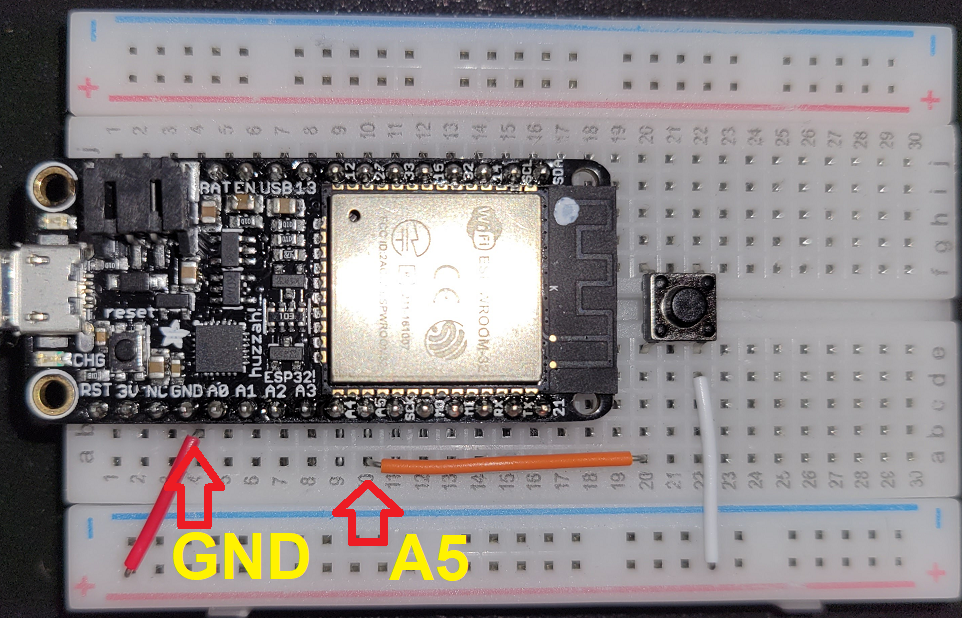
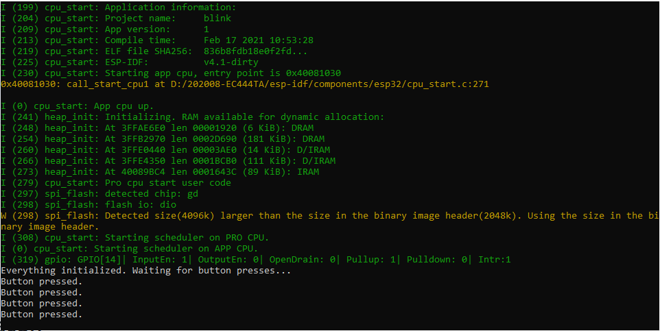
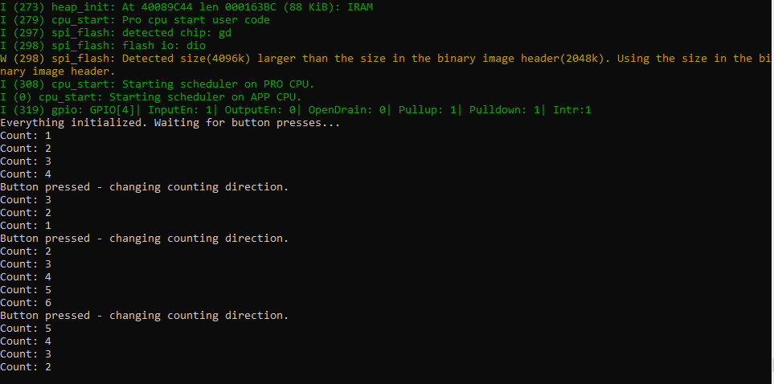

# Button Interrupt Examples

Registers a hardware Interrupt Service Routine (ISR) to do work when a hardware interrupt is received (i.e., a button is pressed).

Starts a FreeRTOS task to write to the console/monitor after the interrupt is triggered.

**Two examples included:**
| Examples | C File | Description |
| --- | --- | --- |
| Simple | main_1.c | Minimal example prints a statement on each button press. Use any GPIO input pin you like. |
| Complex | main_2.c | More complex example includes a timer interrupt and queues to manage interrupt events; counts up every second (on the console) and changes counting direction on each button press. **For now, only use GPIO #4 (pin A5).**  |

## Important Notes  
1. The line `io_conf.pull_up_en = 1` in `button_init()` means the GPIO's internal pull-up resistor is enabled. I.e., the GPIO will be high by default. Hence the other side of the button (opposite the GPIO wiring) goes to ground (see wiring image below). Pushing the button pulls the GPIO down to ground.  

2. The line `io_conf.intr_type = GPIO_PIN_INTR_POSEDGE` in `button_init()` means the interrupt will watch for a *positive edge* to transit the GPIO. Since the GPIO is being pulled up by default and the button press will pull it down, the positive edge will occur when you *release* the button. I.e., if you hold the button down, the interrupt will NOT fire (until you release the button).  

3. By only setting `flag=1` in `gpio_isr_handler(void* arg)` in the **Simple Example**, you avoid issues with button chatter. I.e., this is a simple and simplistic (though not perfect) button debouncing mechanism. A better debouncing method is implemented as a queue in the Complex Example.   

4. **EXTRA IMPORTANT:** Interrupts and ISRs are meant to perform minimal work! Hence here (in `gpio_isr_handler(void* arg)`) we just change the value of a single integer or add to a queue. Do **NOT** perform complex work inside your interrupt handler. Specifically, **do NOT put `printf` satatements** inside your interrupt handler - put these in your task instead. 

## Associated Images

### Wiring (for both examples)

### Simple Example Expected Output

### Complex Example Expected Output

